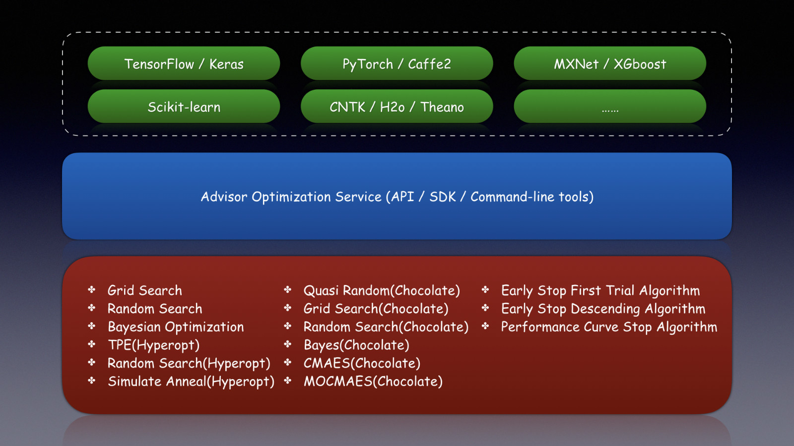
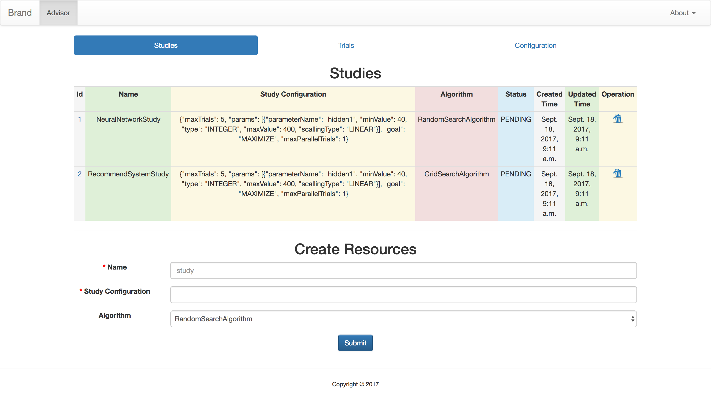
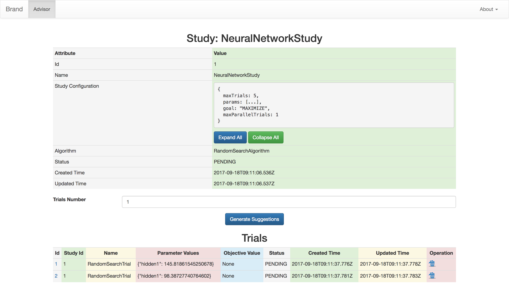
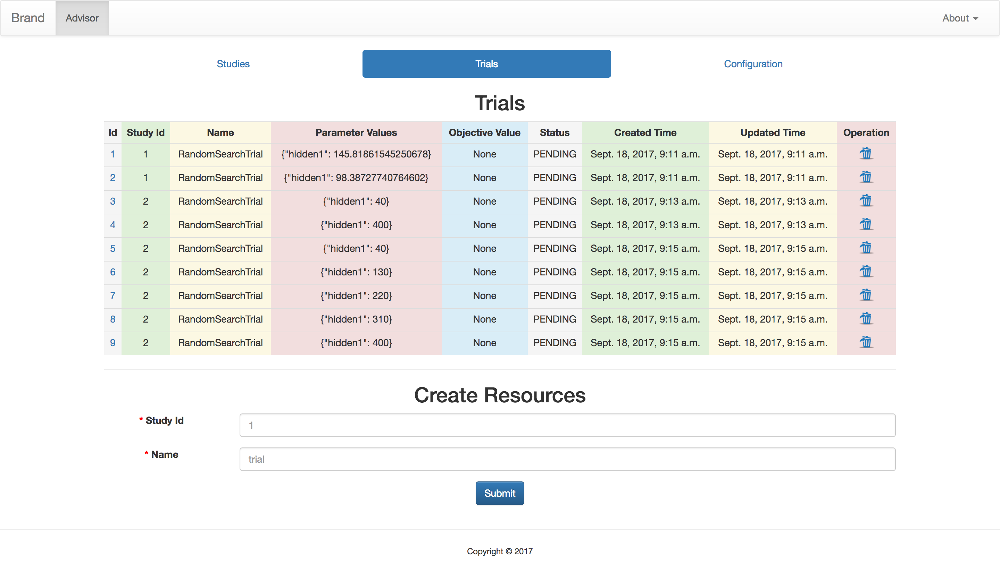
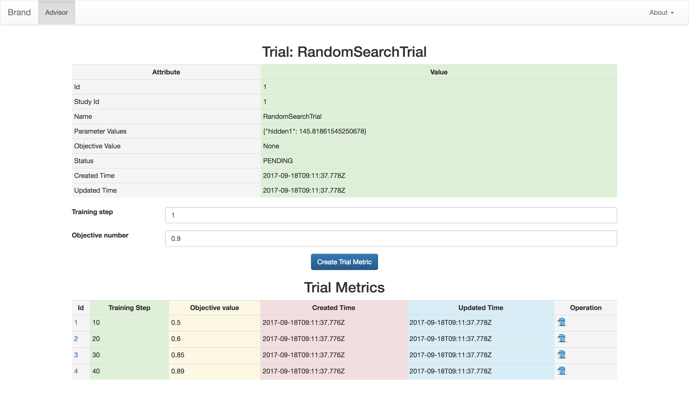

# Advisor



## Introduction

Advisor is the hyper parameters tuning system for black box optimization.

It is the open-source implementation of [Google Vizier](https://static.googleusercontent.com/media/research.google.com/en//pubs/archive/46180.pdf) with these features.

* Easy to use with API, SDK, WEB and CLI
* Support abstractions of Study and Trial
* Included search and early stop algorithms
* Recommend parameters with trained model
* Same programming interfaces as Google Vizier
* Command-line tool just like Microsoft NNI.

## Supported Algorithms

* [x] Grid Search
* [x] Random Search
* [x] Bayesian Optimization
* [x] TPE(Hyperopt)
* [x] Random Search(Hyperopt)
* [x] Simulate Anneal(Hyperopt)
* [x] Quasi Random(Chocolate)
* [x] Grid Search(Chocolate)
* [x] Random Search(Chocolate)
* [x] Bayes(Chocolate)
* [x] CMAES(Chocolate)
* [x] MOCMAES(Chocolate)
* [ ] SMAC Algorithm
* [x] Bayesian Optimization(Skopt)
* [x] Early Stop First Trial Algorithm
* [x] Early Stop Descending Algorithm
* [ ] Performance Curve Stop Algorithm


## Quick Start

It is easy to setup advisor service in local machine.

```bash
pip install advisor

advisor_admin server start
```

Then go to `http://127.0.0.1:8000` in the browser and submit tuning jobs.

```bash
git clone --depth 1 https://github.com/tobegit3hub/advisor.git && cd ./advisor/

advisor run -f ./advisor_client/examples/python_function/config.json

advisor study describe -s demo
```

## Advisor Server

Run server with official package.

```bash
advisor_admin server start
```

Or run with official docker image.

```bash
docker run -d -p 8000:8000 tobegit3hub/advisor
```

Or run with docker-compose.

```bash

wget https://raw.githubusercontent.com/tobegit3hub/advisor/master/docker-compose.yml

docker-compose up -d
```

Or run in Kubernetes cluster.

```bash
wget https://raw.githubusercontent.com/tobegit3hub/advisor/master/kubernetes_advisor.yaml

kubectl create -f ./kubernetes_advisor.yaml
```

Or run from scratch with source code.

```bash
git clone --depth 1 https://github.com/tobegit3hub/advisor.git && cd ./advisor/

pip install -r ./requirements.txt

./manage.py migrate

./manage.py runserver 0.0.0.0:8000
```

## Advisor Client

Install with `pip` or use docker container.

```bash
pip install advisor

docker run -it --net=host tobegit3hub/advisor bash
```

Use the command-line tool.

```bash
export ADVISOR_ENDPOINT="http://127.0.0.1:8000"

advisor study list

advisor study describe -s "demo"

advisor trial list --study_name "demo"
```

Use admin tool to start/stop server.

```bash
advisor_admin server start

advisor_admin server stop
```

Use the Python SDK.

```python
client = AdvisorClient()

# Create the study
study_configuration = {
        "goal": "MAXIMIZE",
        "params": [
                {
                        "parameterName": "hidden1",
                        "type": "INTEGER",
                        "minValue": 40,
                        "maxValue": 400,
                        "scalingType": "LINEAR"
                }
        ]
}
study = client.create_study("demo", study_configuration)

# Get suggested trials
trials = client.get_suggestions(study, 3)

# Complete the trial
trial = trials[0]
trial_metrics = 1.0
client.complete_trial(trial, trial_metrics)
```

Please checkout [examples](./advisor_client/examples/) for more usage.

## Configuration

Study configuration describe the search space of parameters. It supports four types and here is the example.

```json
{
  "goal": "MAXIMIZE",
  "randomInitTrials": 1,
  "maxTrials": 5,
  "maxParallelTrials": 1,
  "params": [
    {
      "parameterName": "hidden1",
      "type": "INTEGER",
      "minValue": 1,
      "maxValue": 10,
      "scalingType": "LINEAR"
    },
    {
      "parameterName": "learning_rate",
      "type": "DOUBLE",
      "minValue": 0.01,
      "maxValue": 0.5,
      "scalingType": "LINEAR"
    },
    {
      "parameterName": "hidden2",
      "type": "DISCRETE",
      "feasiblePoints": "8, 16, 32, 64",
      "scalingType": "LINEAR"
    },
    {
      "parameterName": "optimizer",
      "type": "CATEGORICAL",
      "feasiblePoints": "sgd, adagrad, adam, ftrl",
      "scalingType": "LINEAR"
    },
    {
      "parameterName": "batch_normalization",
      "type": "CATEGORICAL",
      "feasiblePoints": "true, false",
      "scalingType": "LINEAR"
    }
  ]
}
```

Here is the configuration file in JSON format for `advisor run`.

```json
{
  "name": "demo",
  "algorithm": "BayesianOptimization",
  "trialNumber": 10,
  "concurrency": 1,
  "path": "./advisor_client/examples/python_function/",
  "command": "./min_function.py",
  "search_space": {
      "goal": "MINIMIZE",
      "randomInitTrials": 3,
      "params": [
          {
              "parameterName": "x",
              "type": "DOUBLE",
              "minValue": -10.0,
              "maxValue": 10.0,
              "scalingType": "LINEAR"
          }
      ]
  }
}
```

Or use the equivalent configuration file in YAML format.

```yaml
name: "demo"
algorithm: "BayesianOptimization"
trialNumber: 10
path: "./advisor_client/examples/python_function/"
command: "./min_function.py"
search_space:
  goal: "MINIMIZE"
  randomInitTrials: 3
  params:
    - parameterName: "x"
      type: "DOUBLE"
      minValue: -10.0
      maxValue: 10.0
```

## Screenshots

List all the studies and create/delete the studies easily.



List the detail of study and all the related trials.



List all the trials and create/delete the trials easily.



List the detail of trial and all the related metrics.



## Development

You can edit the source code and test without re-deploying the server and client.

```
git clone git@github.com:tobegit3hub/advisor.git

cd ./advisor/advisor_client/

python ./setup.py develop

export PYTHONPATH="/Library/Python/2.7/site-packages/:$PYTHONPATH"
```